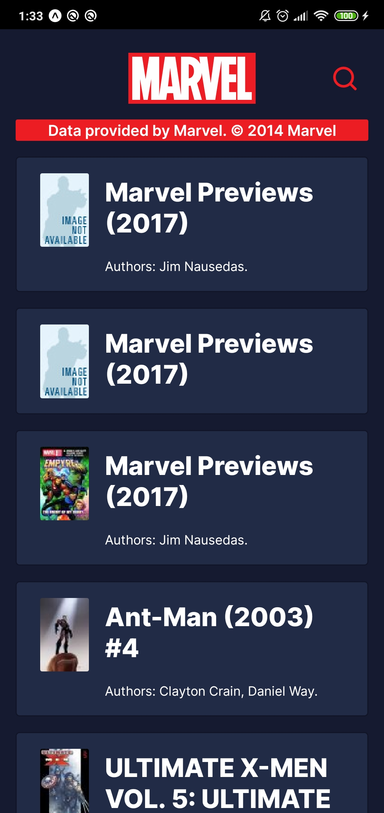
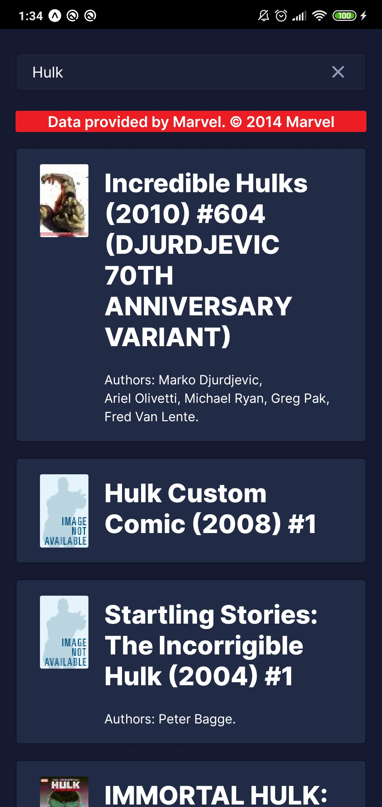
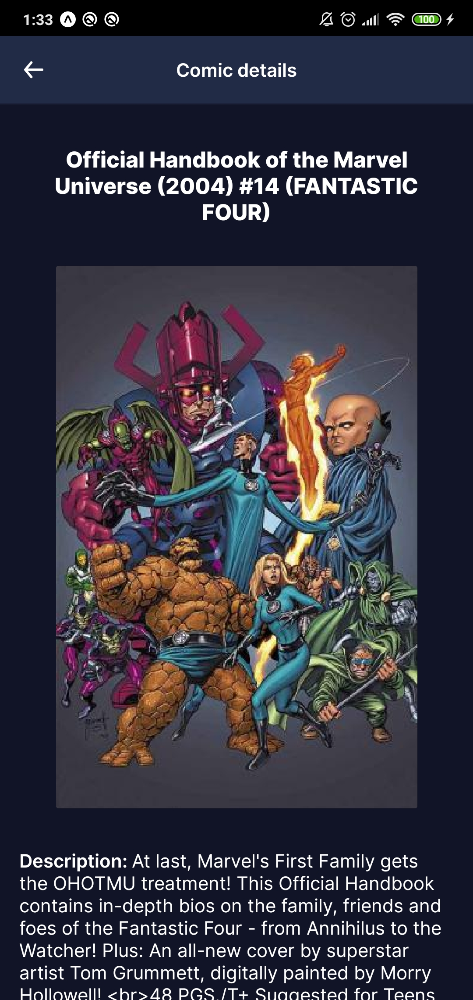

# Marvel Comics App

A comics informational App made by [@LucasFsc](https://github.com/LucasFsc).

## About

This app was made using [UI Kitten](https://akveo.github.io/react-native-ui-kitten/) visual framework and some others awesome libraries. All data consumed by the app was provided by Marvel. ©, thanks for providing such amazing [API](https://developer.marvel.com/).

|Main screen|Search by character name|Comic details|
|-|-|-|
||||

## Setup

To setup the project, assuming you have `yarn` installed, run the following command:

```sh
yarn setup
```

and change the `.env` file dummy informations.
